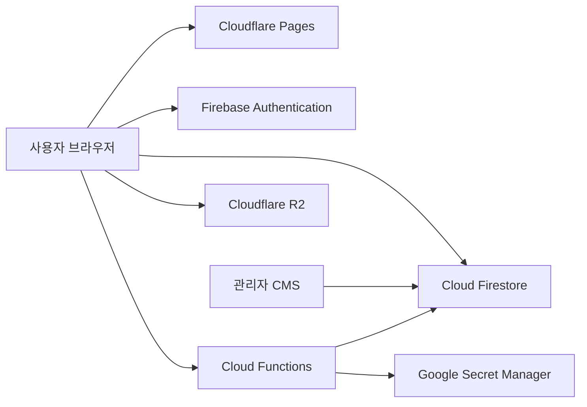

# Grit Edu LMS/CMS

학원 공개 웹사이트, 온라인 강의, 오프라인 수업, 역할별 대시보드와 관리자 CMS를 통합한 교육 운영 웹 서비스입니다.

[](https://gritedu.kr)


> 이 저장소는 포트폴리오용 공개 스냅샷입니다. 운영 데이터, 검색엔진 소유권 파일, Firebase 자격증명과 비공개 작업 파일은 포함하지 않습니다.

## 주요 기능

- 공개 사이트: 강의·강사·시간표·학원 안내·상담·팝업
- 회원 시스템: 학생·회원·학부모·강사·관리자 역할 분리
- 온라인 LMS: 강의 공개 상태, 수강 연결, 커리큘럼과 학습 진도
- 오프라인 수업: 반·담당 강사·학생 배정·수업 회차·접근 관리
- 관리자 CMS: 계정, 강의, 반, 시간표, 사이트 콘텐츠와 운영 설정
- 인증·보안: Firebase Authentication, 이메일 인증, Firestore Rules
- 운영 자동화: 만료 기록 정리, strict 빌드 검증, Cloudflare Pages 배포
- 공개 이미지 운영: Cloudflare R2 URL 기반 이미지 교체

## 역할별 화면

| 역할 | 제공 기능 |
| --- | --- |
| 방문자 | 강의, 강사, 시간표와 학원 정보 조회 |
| 학생 | 온라인 강의, 오프라인 반과 학습 정보 확인 |
| 회원·학부모 | 수강 정보 관리와 자녀 계정 연결 |
| 강사 | 담당 강의, 반과 수강생 조회 |
| 관리자 | 계정·콘텐츠·수업·운영 데이터 통합 관리 |

## 아키텍처



- Cloudflare Pages가 정적 HTML·CSS·JavaScript를 제공합니다.
- Firebase Authentication과 Firestore Rules가 역할별 접근을 제어합니다.
- Cloud Functions가 이메일 인증, 계정 연결과 데이터 정리를 처리합니다.
- CMS 설정은 Firestore에, 자주 교체되는 공개 이미지는 R2에 저장합니다.

## 기술 스택

| 영역 | 기술 |
| --- | --- |
| Frontend | HTML5, CSS3, Vanilla JavaScript, ES Modules |
| UI | Responsive Web, Dark Mode, PWA |
| Auth·Database | Firebase Authentication, Cloud Firestore |
| Server | Cloud Functions for Firebase, Nodemailer |
| Security | Firestore Security Rules, Google Secret Manager |
| Hosting·Assets | Cloudflare Pages, Cloudflare R2 |
| Build | Node.js, Sharp, PostCSS, cssnano, Terser, ESLint |

## 프로젝트 구조

```text
├─ assets/            # CSS, JavaScript, 이미지와 공통 partial
├─ members/           # 관리자·학생·회원·강사 역할별 화면
├─ functions/         # Firebase Cloud Functions
├─ scripts/           # 빌드, 검증과 유지보수 도구
├─ docs/              # 설계·운영·감사 문서
├─ md/                # Firestore 데이터 모델
├─ firestore.rules    # Firestore 접근 권한
├─ firebase.json      # Firebase 로컬 설정
└─ package.json
```

## 로컬 실행

요구 환경은 Node.js 22와 npm입니다.

```bash
git clone https://github.com/ksh0330/gritedu-lms.git
cd gritedu-lms
npm ci
npm --prefix functions ci
```

`assets/js/firebase-init.js`의 예시값을 본인의 Firebase 웹 앱 설정으로 교체합니다.

```js
const firebaseConfig = {
  apiKey: "YOUR_FIREBASE_WEB_API_KEY",
  authDomain: "YOUR_PROJECT_ID.firebaseapp.com",
  projectId: "YOUR_PROJECT_ID",
  messagingSenderId: "YOUR_MESSAGING_SENDER_ID",
  appId: "YOUR_FIREBASE_APP_ID"
};
```

빌드 및 미리보기:

```bash
npm run prebuild
npm run verify
npm run preview
```

## 주요 명령어

| 명령어 | 설명 |
| --- | --- |
| `npm run lint` | 프런트엔드 ESLint 검사 |
| `npm run prebuild:strict` | strict 프로덕션 빌드 |
| `npm run verify:strict` | 빌드 산출물 검증 |
| `npm run check:rules:strict` | Firestore Rules 준비 상태 검사 |
| `npm run check:functions:strict` | Functions 준비 상태 검사 |
| `npm run ready:deploy` | 전체 배포 전 검사 |

## 공개 저장소 보안 기준

- Firebase 웹 설정은 예시값만 제공합니다.
- 서비스 계정 JSON, Secret, `.env`, Firebase 로그는 커밋하지 않습니다.
- 검색엔진 소유권 인증 HTML과 변환 도구 작업 파일은 제외합니다.
- 학생별 자료, 성적표, 과제와 내부 문서는 public R2에 저장하지 않습니다.
- 실제 데이터 접근 권한은 API Key 은닉이 아니라 Firestore Rules와 App Check로 보호해야 합니다.

세부 데이터 구조와 운영 설계는 [프로젝트 상태](PROJECT_STATE.md), [데이터베이스 스키마](md/DATABASE_SCHEMA.md), [문서 색인](PROJECT_DOCS_INDEX.md)을 참고하세요.

## License

본 저장소는 프로젝트 소개와 포트폴리오 열람을 위한 공개 소스입니다. 별도 허가 없는 복제, 재배포와 상업적 이용을 허용하지 않습니다.
